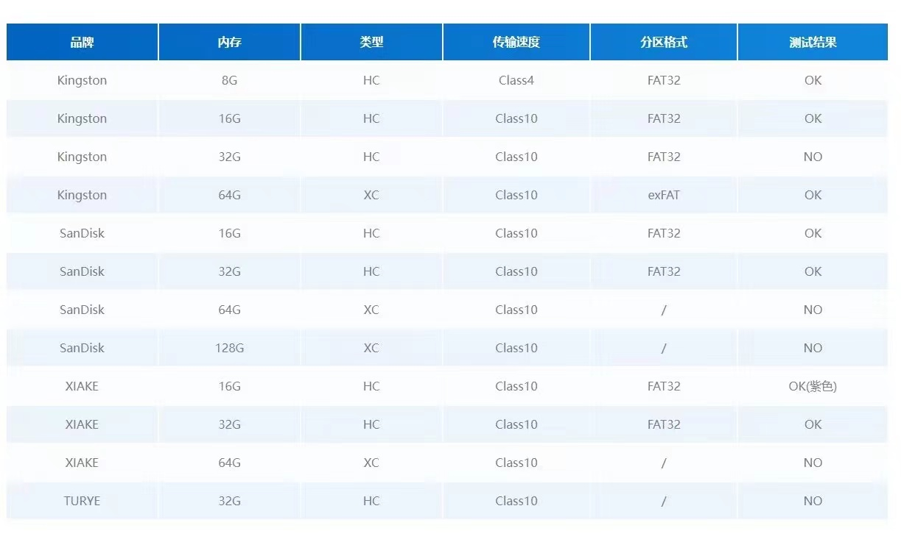

CanMV FAQ
===============

芯片供应正常吗？
---------------------

敞开供应，价格美丽。可通过嘉楠官网联系销售对接，或发送合作邮件至 [salesAI@canaan-creative.com](mailto://salesAI@canaan-creative.com)

我的TF/Micro SD 卡不能正常识别？
-----------------------------------

TF/Micro SD 读取不到现象及解决方法

* ***CanMV 使用 SPI 驱动 SD 卡，有些卡不兼容 SPI 协议，请尽量采购正规厂商的卡***

* 确认 SD 能否在电脑上正常使用，如果不能即 SD 已损坏

* 电脑能够正常使用，读写 SD，但 CanMV 开发板无法使用

    * SD 卡未格式化为 MBR 分区 FAT32 格式

* 电脑能够正常使用 SD 卡，也确认 SD 卡的磁盘格式为 FAT32，但 CanMV 开发板依旧无法使用

    * 可能存在的原因：部分 SD 出厂时，sd 中没有磁盘分区表，或者磁盘分区表类型不是 MBR，可使用 Diskgenius 将 SD 卡转换为 MBR 格式


TF/Micro SD 卡支持多大容量
-----------------------------

测试过 **1TB** 都可以使用


* 哪些 SD 卡可以使用?




为什么TF卡格式没有问题，但是无法读取TF卡，挂载失败
-----------------------------------------------------

请使用
```python
from machine import SDCard
SDCard.remount()
```

进行重新挂载
使用
```python
def sd_check():
    import os
    try:
        os.listdir("/sd/.")
    except Exception as e:
        return False
    return True
print(sd_check())
```

进行检测是否挂载成功

执行代码遇到报错：OSEerror: [Errno 2] ENOENT
-------------------------------

所需要读取的文件不存在对应的路径上，如果这个文件是在sd卡上的话，建议查看sd卡是否挂载了

可使用代码判断内存是否挂载上，如果挂载不上会返回回False，可能是卡不兼容，或者是卡没有格式化好

```python
def sd_check():
    import os
    try:
        os.listdir("/sd/.")
    except Exception as e:
        return False
    return True
print(sd_check())
```

能换摄像头吗？当前支持哪些sensor?
------------------------------------

目前支持 OV2640,OV5640,OV5642,OV,7740,OV3660,GC0328,GC2145,GC0308

如果需要更换，请确认sensor电平与引脚参数一致。


为什么连接了 IDE 帧率降低了很多
----------------------------------

K210 没有 USB 外设， 因此只能使用串口与 IDE 通信， 速度不如 USB 设备快，因此会影响帧率， 可以关闭 IDE 的摄像头预览

为什么 IDE 上预览的摄像头图像很模糊
----------------------------------------

K210 没有 USB 外设， 因此只能使用串口与 IDE 通信， 速度不如 USB 设备快， 因此对图片进行了压缩，如果需要看清晰的图像请在开发板的屏幕上看，或者保存成图片传到电脑查看

所以 IDE 的图像预览功能主要是给教学和演示使用， 平时建议使用屏幕，
可以使用以下代码来设置预览图质量

```python
sensor.set_jb_quality(95)
```

这样就将预览图的质量设置为了 95%， 但是帧率会有明显降低
