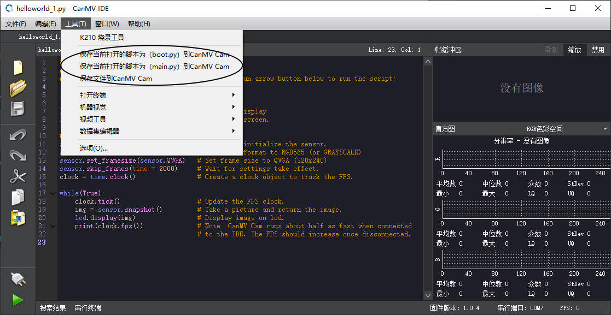
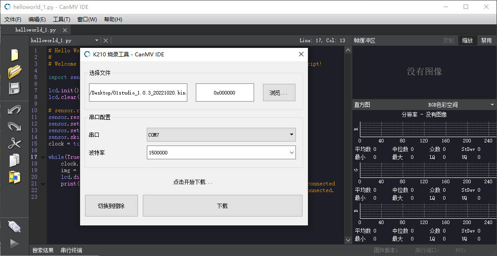

CanMV FAQ
===============

## 1. 芯片供应正常吗？


敞开供应，价格美丽。可通过嘉楠官网联系销售对接，或发送合作邮件至 [salesAI@canaan-creative.com](mailto://salesAI@canaan-creative.com)

## 2. 我的TF/Micro SD 卡不能正常识别？

TF/Micro SD 读取不到现象及解决方法

* ***CanMV 使用 SPI 驱动 SD 卡，有些卡不兼容 SPI 协议，请尽量采购正规厂商的卡***

* 确认 SD 能否在电脑上正常使用，如果不能即 SD 已损坏

* 电脑能够正常使用，读写 SD，但 CanMV 开发板无法使用

    * SD 卡未格式化为 MBR 分区 FAT32 格式

* 电脑能够正常使用 SD 卡，也确认 SD 卡的磁盘格式为 FAT32，但 CanMV 开发板依旧无法使用

    * 可能存在的原因：部分 SD 出厂时，sd 中没有磁盘分区表，或者磁盘分区表类型不是 MBR，可使用 Diskgenius 将 SD 卡转换为 MBR 格式


## 3. TF/Micro SD 卡支持多大容量

测试过 **1TB** 都可以使用


* 哪些 SD 卡可以使用?


## 4. 为什么TF卡格式没有问题，但是无法读取TF卡，挂载失败

请使用
```python
from machine import SDCard
SDCard.remount()
```

进行重新挂载
使用
```python
def sd_check():
    import os
    try:
        os.listdir("/sd/.")
    except Exception as e:
        return False
    return True
print(sd_check())
```

进行检测是否挂载成功

## 5. 执行代码遇到报错：OSEerror: [Errno 2] ENOENT

所需要读取的文件不存在对应的路径上，如果这个文件是在sd卡上的话，建议查看sd卡是否挂载了

可使用代码判断内存是否挂载上，如果挂载不上会返回回False，可能是卡不兼容，或者是卡没有格式化好

```python
def sd_check():
    import os
    try:
        os.listdir("/sd/.")
    except Exception as e:
        return False
    return True
print(sd_check())
```

## 6. 能换摄像头吗？当前支持哪些sensor?

目前支持 OV2640,OV5640,OV5642,OV,7740,OV3660,GC0328,GC2145,GC0308

如果需要更换，请确认sensor电平与引脚参数一致。


## 7. 为什么连接了 IDE 帧率降低了很多

K210 没有 USB 外设， 因此只能使用串口与 IDE 通信， 速度不如 USB 设备快，因此会影响帧率， 可以关闭 IDE 的摄像头预览

## 8. 为什么 IDE 上预览的摄像头图像很模糊
----------------------------------------

K210 没有 USB 外设， 因此只能使用串口与 IDE 通信， 速度不如 USB 设备快， 因此对图片进行了压缩，如果需要看清晰的图像请在开发板的屏幕上看，或者保存成图片传到电脑查看

所以 IDE 的图像预览功能主要是给教学和演示使用， 平时建议使用屏幕，
可以使用以下代码来设置预览图质量

```python
sensor.set_jb_quality(95)
```

这样就将预览图的质量设置为了 95%， 但是帧率会有明显降低

## 9. IDE 保存文件功能如何使用

### 文件保存在哪里

如果开发板有插入 sd 卡，并正常识别（`sd_check()`返回`True`）,则默认保存位置为 sd 卡，如果没有 sd 卡，则默认保存到 flash 内部文件系统

***使用 `保存文件到CanMV Cam` 可指定保存位置***

### 无法点击保存按钮？

使用 IDE 保存文件到 CanMV 需要连接到IDE才可使用该功能

如果当前编辑器没有打开文件，则保存 main.py/boot.py 不可选择



### 保存文件到CanMV Cam


点击 `打开` 选择要保存到 `CanMV Cam` 的文件

如果不指定路径，则自动解析文件名(不支持中文文件名)，并保存到当前系统目录下(有 sd 默认保存 sd, 没有则默认保存到 flash)

用户也可以指定保存路径

例如保存到 `/sd/test.py` 会将文件保存到 sd 上，文件名为 `test.py`

或者`/flash/test.bin` 或将文件保存到 flash上，文件名为 `test.bin`

保存比较大的文件有几率失败，建议使用 sd 卡

或者使用烧录工具烧录到 flash 的指定偏移处（固件大小(3M内)-13M 这部分区域都可使用）

## 10. K210 烧录工具如何使用

### 烧录固件



点击`浏览`选择需要烧录的文件，指定烧录偏移，点击下载开始下载

同时也支持`kfpkg`文件的下载

### 擦除 Flash


#### 部分擦除

用户手动指定擦除起始地址以及擦除长度

选择`CanMV 文件系统`模板，点击`加载模板`，会自动指定文件系统的起始地址以及长度

一般在运行不正常时，通过擦除文件系统可解决大多数问题

#### 全片擦除

将整片Flash擦除

### 烧录/擦除报错

如果在使用过程中遇到报错，先确认串口是否选择正确，以及降低工作波特率（115200），并再次尝试
