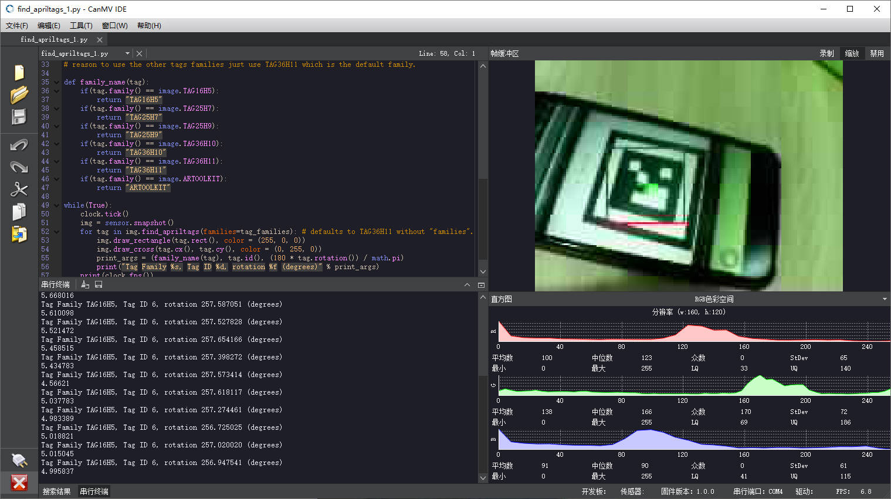

`AprilTag` 标记追踪
======================

## AprilTag 简介

参考资料：[https://april.eecs.umich.edu/software/apriltag.html](https://april.eecs.umich.edu/software/apriltag.html)

AprilTag是一个视觉基准系统，可用于各种任务，包括AR，机器人和相机校准。

这个tag可以直接用打印机打印出来，而AprilTag检测程序可以计算相对于相机的精确3D位置，方向和id。

## AprilTag 种类

`AprilTag` 的种类叫家族（ `family` ）,有下面的几种：
* TAG16H5 → 0 to 29  
* TAG25H7 → 0 to 241  
* TAG25H9 → 0 to 34  
* TAG36H10 → 0 to 2319
* TAG36H11 → 0 to 586
* ARTOOLKIT → 0 to 511

也就是说 `TAG16H5` 的家族（ `family` ）有30个，每一个都有对应的 id ，从0~29。 那么不同的家族，有什么区别呢？ 比如说 `TAG16H5` 的有效区域是 4x4 的方块，那么它比 `TAG36H11` 看的更远（因为他有 6x6 个方块）。 但是 `TAG16H5` 的错误率比 `TAG36H11` 高很多，因为 `TAG36H11` 的校验信息多，所以，如果没有别的理由，推荐使用 `TAG36H11` 。

## AprilTag 生成 

可以通过在线生成网站生成对应 AprilTag，也可以通过 `CanMV IDE` 生成。

在 `CanMV IDE` 中，依次点击 [工具] -> [机器视觉] -> [`AprilTag` 生成器]。 推荐选择 “ `TAG36H11` ”。生成之后，可以将其打印出来或者使用屏幕显示（但可能会反光）。

## AprilTag 识别

识别 `AprilTag` 使用函数 [find_apriltags](../library/canmv/image.md#find_apriltags)

对应例程在 <a class="reference internal" href="../demo/index.html#april-tags"><cite>April-Tags</cite></a>

