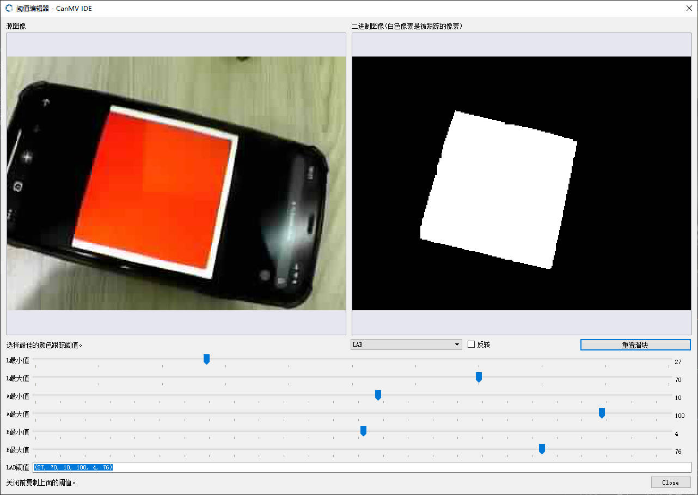
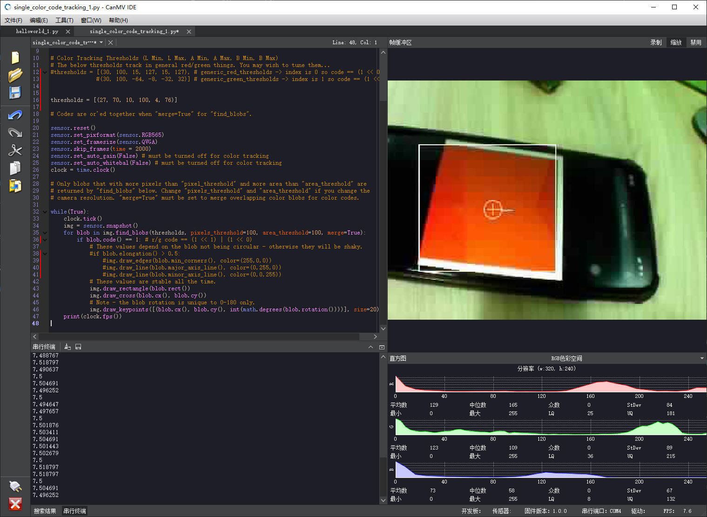

颜色追踪
============

如何追踪特定颜色的色块，是我们经常遇到的一个问题。通过 CanMV， 我们可以比较方便快捷的解决这类需求。

## 相关方法
在`CanMV` 中可以通过调用 `find_blobs` 方法来寻找色块。方法调用方式如下：
```python
image.find_blobs(thresholds, roi=Auto, x_stride=2, y_stride=1, 
                 invert=False, area_threshold=10, pixels_threshold=10, 
                 merge=False, margin=0, threshold_cb=None, merge_cb=None)
```

函数接口定义可以参考 [findblobs](../library/canmv/image.md#find_blobs)

## 颜色阈值
颜色阈值的结构定义如下：
```
red = (minL, maxL, minA, maxA, minB, maxB)
```
这里采用的是Lab色彩空间（Lab color space），其中维度 L 表示亮度，a 和 b 表示颜色对立维度，它基于非线性压缩的 CIE XYZ色彩空间坐标。元组里面的数值分别是 L A B 的最大值和最小值。

## 参数设置技巧
如果用肉眼来进行阈值参数，调试起来是一项非常辛苦的工作，还好  `CanMV IDE` 自带的阈值编辑器，可以方便我们进行阈值调节设定。  

首先，在 `CanMV IDE` 里运行 `helloworld.py` 程序，进行图像采集。 然后我们依次点击 “工具” > “机器视觉” > “阈值编辑器”，在源图像位置选择“帧缓冲区”。  


这时我们可以拖动滑动条，进行阈值调整，并观测预览区域，直到预览区域只保留我们想要检测的区域，记录下此时的数值。



## 示例程序演示
下面的示例演示了如何通过 `CanMV` 检测手机里的红色色块。  
上面我们已经利用阈值编辑器得到相应的阈值，将它粘贴到例程的 thresholds 中。然后点击运行程序，即可开始进行色块追踪。  

```python
import sensor, image, time, math

# 更改阈值
thresholds = [(27, 70, 10, 100, 4, 76)]

sensor.reset()
sensor.set_pixformat(sensor.RGB565)
sensor.set_framesize(sensor.QVGA)
sensor.skip_frames(time = 2000)
sensor.set_auto_gain(False) # must be turned off for color tracking
sensor.set_auto_whitebal(False) # must be turned off for color tracking
clock = time.clock()

while(True):
    clock.tick()
    img = sensor.snapshot()
    for blob in img.find_blobs(thresholds, pixels_threshold=100, area_threshold=100, 
                               merge=True):
        if blob.code() == 1:
            img.draw_rectangle(blob.rect())
            img.draw_cross(blob.cx(), blob.cy())
            img.draw_keypoints([(blob.cx(), blob.cy(), 
                                 int(math.degrees(blob.rotation())))], size=20)
    print(clock.fps())
```


