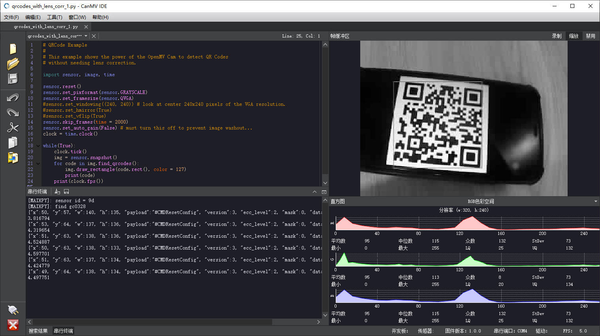
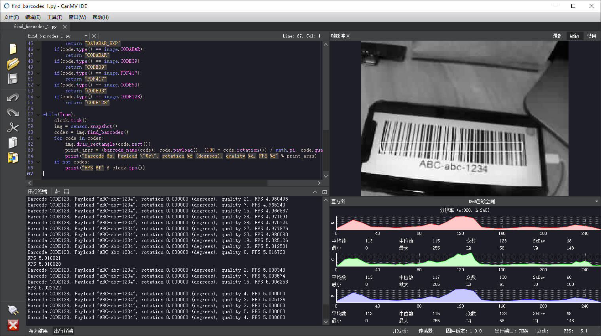

扫码
=============

生活中我们会遇到各种各样的码，它们各自有着不同的用途，也遵循着各自的规范。`CanMV` 支持常见二维码、条形码、AprilTag和DM码，我们可以利用 `CanMV` 进行扫描解码。

`CanMV IDE`中也集成了各种不同码的生成工具，您可以在 [工具] -> [机器视觉]中找到这些工具，用于测试验证。

## 二维码

识别二维码使用函数 [find_qrcodes](../library/canmv/image.md#find_qrcodes)

例程在 [Codes/qrcodes*.py](../demo/16-Codes/qrcodes_with_lens_corr.md)

## 条形码

识别条形码使用函数 [find_barcodes](../library/canmv/image.md#find_barcodes)

对应例程在 [Codes/find_barcodes](../demo/16-Codes/find_barcodes.md)

## `DM` 码

识别 `DM` 码使用函数 [find_datamatrices](../library/canmv/image.md#find_datamatrices)

对应例程在 [Codes/find_datamatrices](../demo/16-Codes/find_datamatrices.md)

