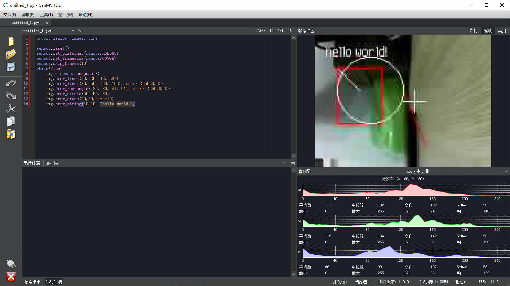

画图
=======

在机器视觉系统中，通常需要在图像中实时显示检测或识别结果，给使用者提供反馈。CanMV也提供了相应的方法实现此类需求。

## 画线

```python
image.draw_line(line_tuple, color=White)
```

在图像中画一条直线。

- line_tuple的格式是(x0, y0, x1, y1)，意思是(x0, y0)到(x1, y1)的直线。

- 颜色可以是灰度值(0-255)，或者是彩色值(r, g, b)的元组。默认为白色。

## 画框

```python
image.draw_rectangle(line_tuple, color=White)
```

在图像中画一个矩形框。

- line_tuple的格式是(x0, y0, x1, y1)，意思是(x0, y0)到(x1, y1)的直线。

- 颜色可以是灰度值(0-255)，或者是彩色值(r, g, b)的元组。默认为白色。

## 画圆

```python
image.draw_circle(x, y, radius, color=White) 
```

在图像中画一个圆。

- x,y是圆心坐标

- radius是圆的半径

## 画十字

```python
image.draw_cross(x, y, size=5, color=White) 
```

在图像中画一个十字形状。

- x,y是坐标

- size是十字两侧的尺寸

## 写字符串

```python
image.draw_string(x, y, text, color=White) 
```

从图像(x,y)位置开始，绘制8x10像素的字符串。 

- x,y是起始坐标。
- text是要绘制的字符串。可以使用\n, \r, 或 \r\n 移动光标到下一行。

## 示例

```python
import sensor, image, time

sensor.reset()
sensor.set_pixformat(sensor.RGB565)
sensor.set_framesize(sensor.QQVGA)
sensor.skip_frames(10)
while(True):
    img = sensor.snapshot()
    img.draw_line((20, 30, 40, 50))
    img.draw_line((80, 50, 100, 100), color=(255,0,0))
    img.draw_rectangle((20, 30, 41, 51), color=(255,0,0))
    img.draw_circle(50, 50, 30)
    img.draw_cross(90,60,size=10)
    img.draw_string(10,10, "hello world!")
```



## 更多

更多例程请查看
<a class="reference internal" href="../demo/index.html#drawing"><cite>Drawing</cite></a>
