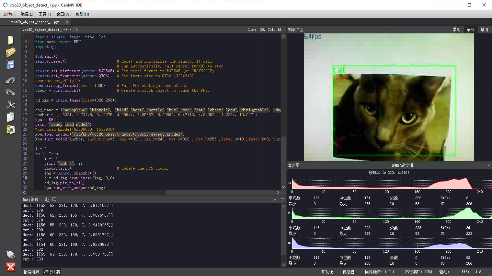
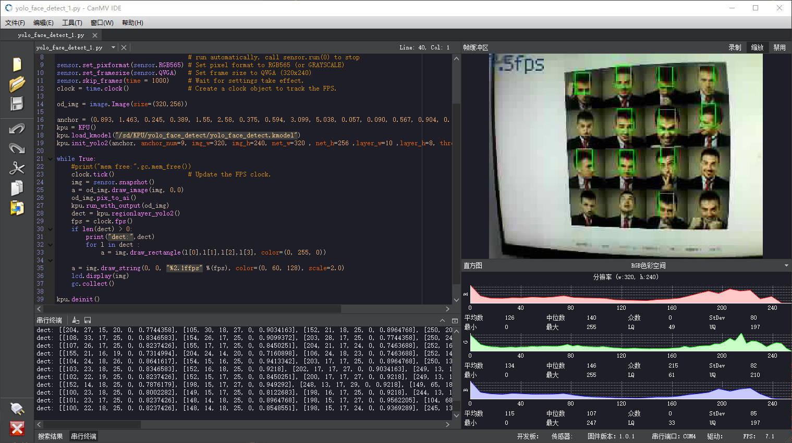

深度学习应用
==================
近年来，深度学习算法应用在全球迅猛发展，在各个不同的场景都取得了优异的成绩，甚至在很多应用领域上超越了我们人类。一般人理解，深度学习算法需要海量运算，需要运行在高性能的服务器上，或者计算机需要安装昂贵的显示加速卡。但是，随着嘉楠公司的 K210 芯片将神经网络硬件加速单元 KPU 集成至 MCU 芯片，我们在 MCU 级别的芯片上，也能享受到深度学习算法带来的好处。

CanMV 使用 Python 语言，对复杂的深度学习算法进行了封装，能让用户通过简单的几行代码，调用深度学习模型进行推理运算，极大的降低了使用门槛。同时，由于深度学习算法的优异表现，最终的检测识别效果通常较传统图像处理算法更优更快更强。`CanMV` 支持使用 `KPU` 加速神经网络计算，可以实现物体分类、人脸检测、人脸识别等等功能。

## 物体分类

基于 `VOC` 数据集的20分类模型

具体请参考例程<a class="reference internal" href="../demo/99-KPU/voc20_object_detect.html">voc20_object_detect</a>

## 人脸检测

基于 `Yolo` 的人脸检测

具体请参考例程<a class="reference internal" href="../demo/99-KPU/yolo_face_detect.html">yolo_face_detect</a>

## 更多例程

利用 CanMV, 可以帮助您实现更多的创意想法。  
更多好玩实用的例程，请看这里的代码示例：
<a class="reference internal" href="../demo/index.html#kpu"><cite>KPU</cite></a>
