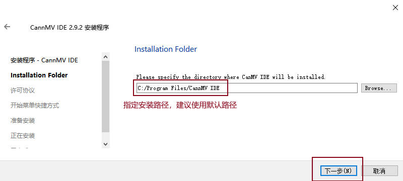
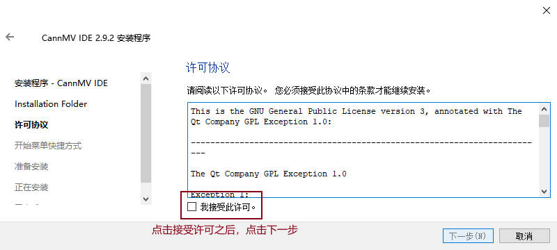
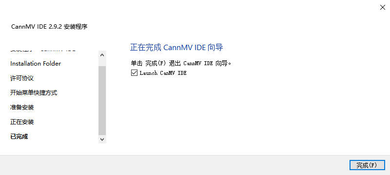
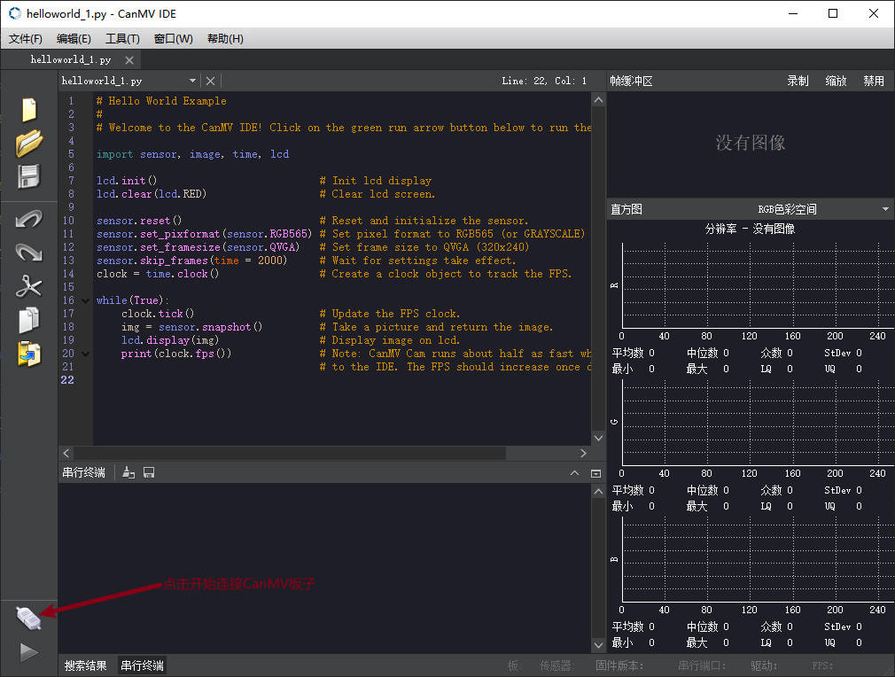
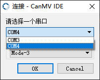
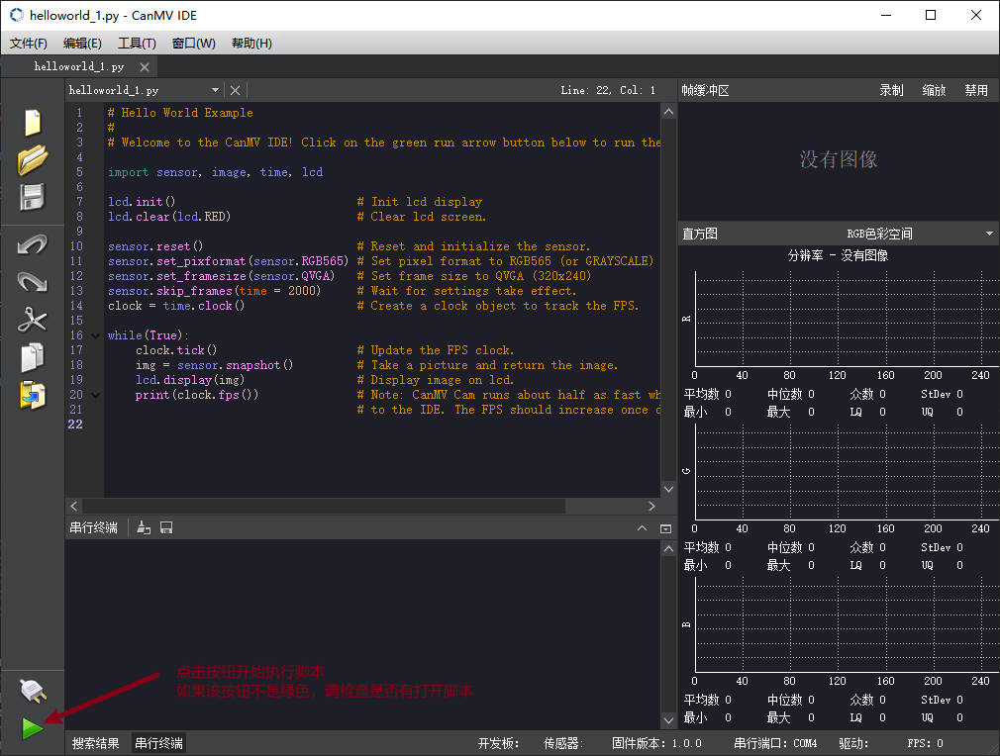
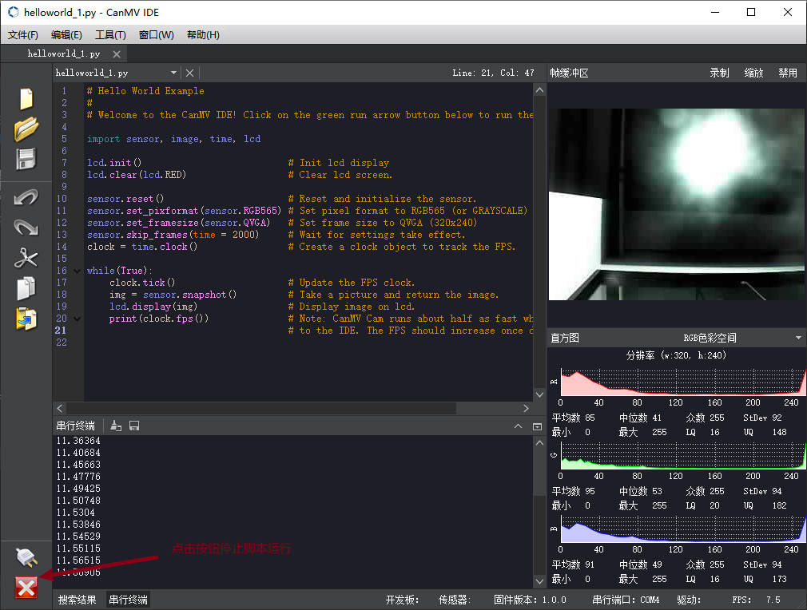

快速上手
==============

## `CanMV IDE` 安装

### 软件下载

* 官网下载：[https://canaan-creative.com/developer](https://canaan-creative.com/developer)

* `github`下载：`TODO`

### 安装流程（Windows）

下载安装包之后，双击打开，然后一直点击下一步即可。

1. 用户可以修改 IDE 安装路径

2. 需要点击同意许可才可继续

3. 直接下一步

CanMV IDE 在第一次启动的时候，会自动拷贝例程以及相关文档到用户目录，这会花费一些时间，请耐心等待。拷贝完成后，会显示 `IDE` 界面，就可以开始使用了。

### 驱动安装

通常情况下，`IDE` 在安装时也会自动安装 `CanMV` 板子所需要的驱动程序，安装完成后即可正常使用。但如果您发现无法正常识别板子，请手动下载相应的驱动并自行安装

>`CH343`驱动程序说明：  
>`CanMV K1` 使用的是 `WCH` 的 `CH342` 转换芯片，与 `CH343` 使用同一个驱动。

[CH343驱动下载](https://www.wch.cn/products/CH343.html)

## 运行 `Hello World` 示例程序 
CanMV IDE 安装完成后，我们使用 Type-C 线将 CanMV K1 板子连接到电脑的任一 USB 端口。让我们开始运行一个 "Hello world" 示例程序看看吧！

### `IDE` 连接
在电脑上打开 CanMV IDE 软件，默认界面如下所示：

### 选择串口连接
点击左下角的`连接板子`图标，软件会自动连接目标开发板。但如果你的电脑已经连接了多个串口，则会弹出串口选择对话框供您选择指定。如果您不清楚哪一个是正确的，也没关系，可以按照从小至大的顺序逐一验证，总有一个是正确的。  
通常来讲，整个连接过程大概会持续 10~20秒左右, 期间板子可能会复位1次，请耐心等候。
> `高级`设置说明：  
> 这与 CanMV 开发板的 boot 与 reset 如何与串口转换芯片的连接配置有关，共有4种组合，默认 CanMV IDE 使用 mode-3 进行连接。如果您使用的板子配置与 CanMV K1 不一致，也可以在这里切换不同配置试一试。

### 运行脚本

CanMV 在运行时默认会打开 `Hello_World.py` 示例程序。 点击`开始`按钮，即可执行当前打开的活动脚本。正常情况下，您可以在 CanMV IDE 右上角的预览区域看到摄像头的实时活动画面，并且在 LCD 屏幕（如果有）也会同时显示。  

CanMV IDE 终端中会显示实时日志输出。目前暂不支持终端输入。

如果要停止脚本运行，直接点击左下角`停止`按钮即可。
